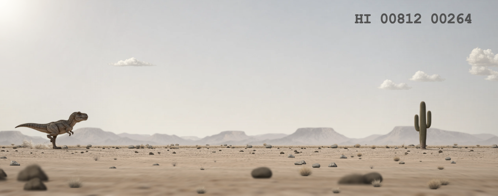
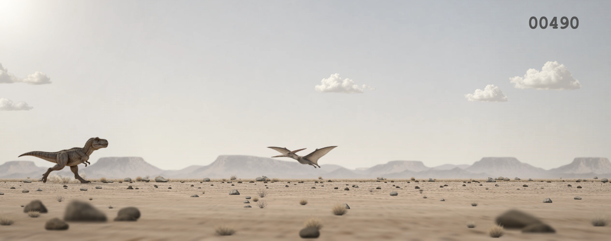
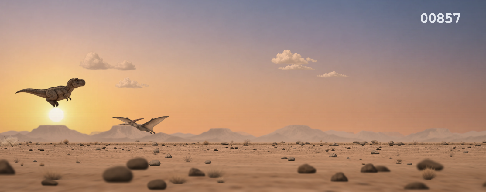
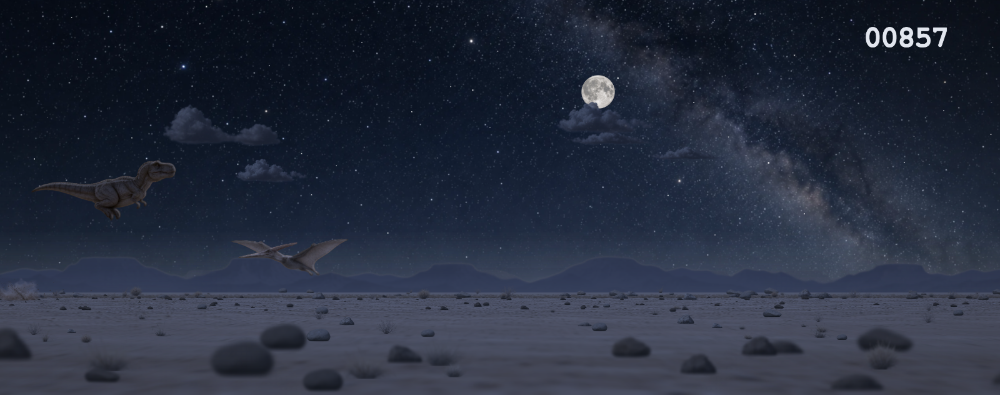
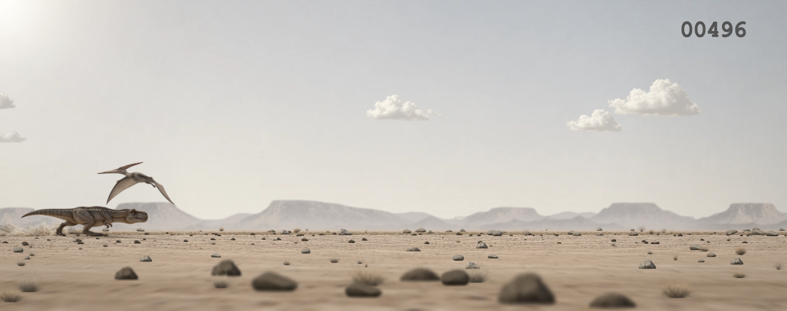
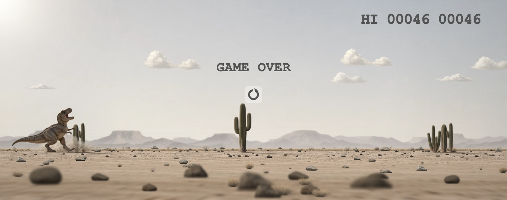
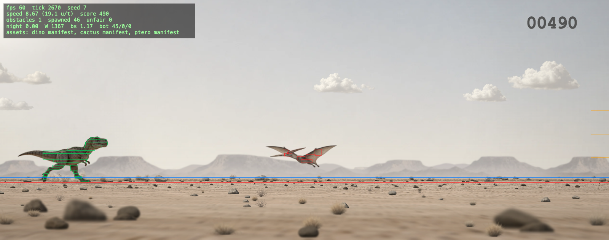

# Real Dinosaur Game

A photorealistic remake of Chrome's offline Dinosaur Game (T-Rex Runner) that runs in any modern browser.

Play it at **https://real-dinosaur-game.kksg.net/**



| | | |
| --- | --- | --- |
|  |  |  |
|  |  |  |

## How to play
Keep the T-rex running: jump over cacti, and duck under or jump over pterodactyls. Your score is the distance run.
- The game speeds up over time. Past a speed threshold, pterodactyls arrive at three altitudes:
  - low: jump
  - mid: duck or jump
  - high: stay standing and let it pass overhead
- The running dino kicks up sand dust behind it with every stride (and on landing and crashing).
- The score blinks with a chime every 100 points.
- Every 700 points the desert fades through dusk into a moonlit, starry night, then back to day.
- The high score is kept in your browser. As in Chrome, the score appears once you start, and HI only once you have a high score.
- With `prefers-reduced-motion` set, there is no camera shake, hint pulse or star twinkle.

## Controls
| Action | Keyboard | Touch / mouse |
| --- | --- | --- |
| Start / jump | Space, ↑, W | tap anywhere / click |
| High / low jump | hold for a full jump; release after ~70–110 ms for a short hop (shorter taps and longer holds both give a full jump, as in Chrome) | same |
| Duck (on the ground) | ↓, S | hold the bottom-left of the screen (the bottom third of its left half; during a run) |
| Fast-fall (in the air) | ↓, S | tap the bottom-left (during a run) |
| Restart | Space, ↑, Enter (from 0.75 s after GAME OVER) | tap anywhere (from 0.75 s after GAME OVER) |
| Mute | M | the speaker button, top left (start, pause and GAME OVER screens) |
| Pause | P, Esc (press again to resume; also automatic when you switch tabs or the window loses focus) | — |
| Debug overlay | Shift + D | — |
| Share | Tab to the Share button, then Space / Enter (in the menu: ↑ ↓ to choose, Enter, Esc to close) | the Share button on GAME OVER |

A jump pressed up to 100 ms before landing fires on landing, as a full jump even if the key is released before touchdown. Holding a key down (auto-repeat) never jumps again.
On a touch screen only the bottom-left (the bottom third of the left half) ducks / fast-falls; a tap anywhere else jumps, so the right thumb always jumps and a tap near the ground never ducks by surprise. The zone is outlined with a dashed frame on the start screen, while paused, for the first seconds of the first run, and on GAME OVER until you have ducked by touch.
The bottom-left duck and fast-fall only apply during a run: on the start screen and on GAME OVER a tap there starts or restarts like a tap anywhere else. ↓ and S never start or restart (as in Chrome).
The speaker button appears on touch screens only, and never during a run (a tap in that corner must stay a jump).

## Language
- The UI is in Japanese or English: the first Japanese (`ja`, `ja-JP`, …) or English (`en`, `en-US`, …) entry in the browser's language list (`navigator.languages`) wins, and English is the fallback (e.g. French only). `fr, ja` gives Japanese; `en-GB, ja` gives English.
- This covers the page title ("Real Dinosaur Game" / 「リアル恐竜ゲーム」), the page description, the on-screen hints and pause text, the screen-reader label and announcements, and the share button and text.
- Changing the browser's language preferences switches the page live.
- `?lang=ja` / `?lang=en` pins a language over the browser's.

## Share your score
On GAME OVER, once a restart is possible (after 0.75 s), a Share button appears near the restart icon. Pressing it never restarts the game. It is never shown during a run, on the start screen or while paused.
- On a computer, the button opens a small menu:
  - Post on X / Post on Bluesky / Share on LINE: opens the post composer in a new tab
  - Share on Facebook: only when there is a public URL (Facebook shares links only)
  - Copy text: copies the post text and shows "Copied!"
  - Save image: saves the GAME OVER screen as a PNG (not offered from `file://`, where the browser does not let the page read its canvas)
  - More…: opens the OS share sheet (Mail, Messages, AirDrop, …); only in browsers with the Web Share API (Safari and Chrome on macOS, Edge and Chrome on Windows, …)
- On phones and tablets (touch screens), the button opens the OS share sheet (which lists your installed apps, such as X or LINE), with a screenshot of the GAME OVER screen (`real-dinosaur-game-score.png`) attached when the browser can share files. Closing the sheet does nothing. Without a share sheet, or if sharing fails, the menu above opens instead.
- In the shared / saved image the score sits at the top right of the playfield and GAME OVER and the restart icon are drawn clear of it (on tall phones a little lower than on screen).
- The text: "I scored 123 in Real Dinosaur Game! 🦖 #RealDinosaurGame", with " New personal best!" after "Game!" when the run beat your previous high score (not on your very first score). In Japanese: 「リアル恐竜ゲームで 123 点を記録！🦖 #RealDinosaurGame」 (plus 「自己ベスト更新！」).
- The URL: `SHARE_URL` in `src/config.js` when set. Otherwise the page's own address when it is served from a public http(s) host, without its query string (the test hooks) or hash. From `file://`, localhost, 127.0.0.1, `*.local` or a private LAN address (10.x, 172.16–31.x, 192.168.x, 169.254.x, …) no URL is added, since nobody else could open it.
- Keyboard: Tab to the button, then Space or Enter. In the menu, ↑ ↓ Home End move, Enter picks, Esc closes. While the button has focus, Space and Enter share instead of restarting: press Esc (hands the keyboard back to the game) or click the game to restart.

## Run it
- Double-click `index.html`. It works from `file://`, with no build step and no external libraries.
- Or serve the folder. This also enables the offline service worker, so later visits load without a network. Images are cached by content hash (the `?v=` that `tools/build_manifest.py` appends), so a changed image shows up on the next load:
  ```sh
  python3 -m http.server 8000   # then open http://localhost:8000/
  ```
- Deploy: `wrangler deploy` publishes the folder as a Cloudflare Workers static-assets site on the custom domain in `wrangler.jsonc`. `.assetsignore` keeps the raw images, previews, tools and docs out of the upload.
- Any window shape shows at least Chrome's view ahead of the dino (about 1350 world units), so your reaction time does not depend on the window shape. On narrow phones the view is shortened just enough to keep the dino at least about 44 CSS px tall.
  - On taller screens the scene extends to fill the screen: extra sky above (45%) and more ground below (55%). GAME OVER and the hints stay with the playfield. So does the score, unless the extra sky is taller than 60 world units (portrait phones, 4:3 tablets): then it pins to the top of the screen, below any notch / safe-area inset, instead of floating mid-sky.
  - Only screens wider than 3.2:1 get side bands, which split into sky and ground colours at the horizon.
- Images load in priority order: the sky, ground, mountains and dino first, then the obstacles, decor and clouds, and the dusk / night skies and moon last. When no image has arrived for 5 s (`LOAD_TIMEOUT_MS`), or 15 s after loading started on a slow but moving connection (`LOAD_TIMEOUT_MAX_MS`), the rest get placeholders so the game can start, and each is swapped in as soon as it loads.

## URL parameters (testing / debugging)
| Parameter | Effect |
| --- | --- |
| `seed=N` | Deterministic run (the same obstacle sequence every time) |
| `bot=1` | Look-ahead autopilot |
| `sim=MS` | Fast-forward MS of game time before the first frame (use with `bot=1`) |
| `freeze=1` | Stop after the first frame (for screenshots) |
| `state=idle` / `state=gameover` | Force a state |
| `night=1` / `dusk=1` | Force the lighting |
| `debug=1` | Show hitboxes, ground lines, fps and speed |
| `lang=ja` / `lang=en` | Pin the UI language (default: the browser's language list; see Language above) |
| `hi=N` | Display a high score of N (display only, never saved; for screenshots) |
| `touch=1` | Show the touch UI (touch hints, duck-zone frame, speaker button; for screenshots) |
| `share=1` | Also show the GAME OVER Share button on `freeze=1` / `bot=1` pages (normally left out of screenshots) |

When any test hook (`state`, `sim`, `bot`, `freeze`, `hi`) is present, the high score is shown but never saved to localStorage.

Example: `index.html?seed=7&bot=1&sim=44500&freeze=1` (a pterodactyl approaching). `window.__rdg` exposes
`{ sim, state, step(ms), config, metrics, ... }`. The images in `docs/screenshots/` were made with headless Chrome:
`--headless=new --window-size=1600,632 --screenshot=out.png "file://…/index.html?seed=3&bot=1&sim=25983&freeze=1&hi=812"`.

## Tests
`node tools/sim_test.js` runs against the real asset hitboxes and exits non-zero on failure. It checks:
- determinism and the absence of NaNs
- bot survival up to MAX speed for 4 minutes on 24 seeds
- the obstacle gap and duplication rules
- the pterodactyl speed threshold and its three altitudes, including that the visible wingtips never sink into the ground or through the dino
- score and high-score maths, the 100-point milestones (GAME OVER always shows the real score) and the 700-point night cycle
- jump physics: a quick tap is a full jump, buffered presses, and a mid-air crash resting on the cactus
- touch input: per-finger holds, the bottom-left duck zone, speaker-button presses that never jump, and a ↓ key held across a pause that ducks again
- the on-screen UI (the Share button and its menu) never acting as game input: clicks, taps, Space / Enter, and the tap that closes the menu
- language negotiation (`navigator.languages`, `?lang=`, live changes), en / ja string parity, the share text, the public-URL rules and the encoding of every share link
- what the Share button opens (the OS share sheet on touch screens, the menu on computers), and that a modifier key such as Shift alone never resumes a pause
- that GAME OVER never overlaps the score in the share image (16 screen sizes, tall phones included)

## How the assets were made
- Every image was generated with **Codex image generation**: 58 generations for the game's images (dino 16 plus 2 image edits, cacti 12, pterodactyl 3, sky 11, terrain 14).
  - The untouched outputs are in `assets/raw/`, including rejected candidates, kept for provenance.
  - The game-ready WebPs in `assets/dino/`, `assets/obstacles/` and `assets/scenery/` total about 1.2 MB.
  - The running dust is drawn from a set of dust sprites (`assets/fx/`, built by `tools/assets/fx.py` from 10 generations, about 0.3 MB), which the service worker precaches too.
- Every prompt attached `reference/screen.webp`. Follow-up generations also attached an earlier "master" image, so every asset shows the same individual animal, the same mountain range and the same palette:
  - the 4-frame run cycle was generated as a single sheet; one frame (`run_1`) was later redone as a Codex image edit so the near and far legs alternate
  - the three wing-flap frames were generated as a single image
  - all sprites were generated with a native transparent background (no chroma keying)
- Reproducible post-processing scripts, `tools/assets/<group>.py` (dino, cactus, ptero, sky, terrain), take `assets/raw/` to game-ready files. Each one handles:
  - alpha clean-up
  - colour grading to the reference photo
  - frame alignment
  - downscaling and WebP export
  - hitbox extraction from the alpha mask
  - writing a manifest fragment, `assets/manifest/<group>.json`
- `tools/build_manifest.py` merges the fragments into `assets/manifest.js`. It is a classic script, so `file://` works.
  ```sh
  python3 -m venv .venv && .venv/bin/pip install -r tools/requirements.txt
  .venv/bin/python tools/assets/terrain.py   # likewise dino / cactus / ptero / sky
  python3 tools/build_manifest.py
  ```
- To regenerate an asset, drop new generations into `assets/raw/`, rerun the group script, then rebuild the manifest. The engine derives the following from the manifest:
  - sprite sizes and hitboxes
  - the dino's length
  - pterodactyl altitudes
  - spawn fairness
- If an image is missing, the engine falls back to a placeholder with the same hitbox shape.
- `tools/build_manifest.py` adds a content hash (`?v=`) to every image path; `--check` also reports images that changed without a rebuild.

## Layout
- `index.html`, `style.css`
- `src/`
  - `config.js`: gameplay and loader tunables (the renderer keeps its own)
  - seeded RNG
  - `sim.js`: pure, deterministic simulation; also loads in Node
  - asset loader
  - WebAudio sound effects
  - input
  - canvas renderer
  - `i18n.js`: UI language (ja / en) and the DOM strings
  - `share.js`: the GAME OVER share button and menu
  - main loop
- `sw.js`: offline cache
- `tools/`: asset pipelines, manifest builder, tests
- `SPEC.md`: the design contract
- `docs/screenshots/`

---

## Recording a video

The gameplay clip for X, [`docs/video/real-dinosaur-game-x.mp4`](docs/video/real-dinosaur-game-x.mp4) (16.45 s, 1920×1080, 60 fps, H.264 High + AAC-LC 48 kHz stereo, about 14 MB), and its poster image [`docs/video/poster.jpg`](docs/video/poster.jpg) are made by the scripts in `tools/record/`. The game itself (`src/`) is not modified: headless Chrome steps a `?freeze=1` page one frame (1/60 s) at a time and captures each frame. Only the length of the night is shortened while recording (see "Night length" below). The sound effects are synthesized by the game's own `src/audio.js`, so every run produces the same video.

```sh
node tools/record/plan.js --from 1 --to 4000         # (optional) search seeds 1–4000 and night lengths, write tools/record/plan.json (~2.5 min)
node tools/record/verify_plan.js                     # (optional) check that Chrome reproduces plan.json exactly
FFMPEG=/path/to/ffmpeg node tools/record/record.js   # capture → sound effects → encode (~3 min)
```

- Settings: seed 704 (seed 909 for the start screen), `?hi=901` (display-only high score), `?lang=en`, and a recording-only night length of 4.8 s. All on-screen text is English ("Press Space to play" and the key help, "GAME OVER", the "Share" button; the score digits are the same in every language).
- Structure: start screen → auto-start (0.8 s) → a 0.4 s crossfade (2.1–2.5 s) → one continuous run (`?sim=57917`, ticks 3475–4335, 861 frames). 987 frames (16.45 s) in total. The length follows the story; it is not padded to 20 s.
- The run (video seconds):
  - Day (from score 672): jumps a small cactus (2.8 s), ducks under a pterodactyl (3.4 s)
  - 700 points (4.0 s): the score blinks and dusk starts right away. During dusk it jumps 3 small cacti (5.0 s) and a low pterodactyl (5.8 s)
  - Night (6.6–8.8 s, 2.2 s of moon, stars and Milky Way): jumps a low pterodactyl (7.5 s)
  - Dawn (from 8.8 s): jumps 3 large cacti (9.1 s) and a low pterodactyl (10.6 s), 800 points (10.8 s). Full daylight again at 11.4 s; ducks under a pterodactyl (12.1 s)
  - The bot is switched off at tick 4213 and the dino runs into 3 large cacti in daylight (14.45 s, tick 4216, score 854)
  - The day-theme "GAME OVER", restart icon and "Share" button (from 15.2 s) are held until 16.45 s (2.0 s after the crash)
- Night length: in the game, night lasts 12 s from the 700-point trigger (`NIGHT_DURATION` = 12000 ms, including the 2.6 s dusk fade), followed by a 2.6 s dawn. A night starting at 4.0 s would not end until 18.6 s, so the GAME OVER would be at night. To show the night in a short clip and still end in daylight, the recorder sets the page's `RDG.config.NIGHT_DURATION` to 4800 ms (after the `?sim=` fast-forward and before the first step; the value is `main.nightDurationMs` in `plan.json`). The night is purely visual and does not affect obstacles, the bot or the RNG, so the run itself is unchanged. The game keeps its 12 s night. The capture also checks every frame's night phase (`nightPhase`) against the Node replay, that it is full daylight from 1.5 s before the crash to the end, and that the share button uses the day theme (this recording has 2.2 s of full night and 3.0 s of daylight before the crash).
- How the story is found: by default (`--story early --lang en`), `plan.js` searches seeds and night lengths for runs where the 700 milestone (the start of dusk) lands at 3.6–4.4 s of video time (counting the start screen; change with `--night-on-at A,B`), a pterodactyl is crossed in full night, there is at least 1.5 s of daylight before the crash, and the planned cactus is hit in daylight. It prefers a jump or a pterodactyl in the short day part, a pterodactyl after dawn, 2.2–3.0 s of full night, and similar.
- Poster: frame 312 of the run (7.3 s into the video): under the full moon and the Milky Way, the dino leaps as a low pterodactyl flies toward it (pinned in `CHOICES` in `record.js`).
- Earlier cuts: `--story day --lang ja` (the second video: exactly 20.0 s, dusk at 7.6 s, seed 1330) and `--story night --lang ja` (the first video: the crash happens at night, with the full 12 s night).
- Requirements: Node 22, Google Chrome, and an ffmpeg with libx264. On macOS the audio is encoded with AudioToolbox AAC (CBR). The working PNGs (about 1.5 GB) go to `$RDG_VIDEO_WORK` (a temp folder if unset).

`record.js` runs three scripts:
- `capture.js`
  - Serves the game with a throwaway `python3 -m http.server` on a random port from 9100 to 9999, and drives headless Chrome over CDP.
  - Each frame is one `__rdg.step(1000 / 60)` and one `Page.captureScreenshot`.
  - For a plan with `main.nightDurationMs`, sets the page's `RDG.config.NIGHT_DURATION` to it after the load and before the first step (recording only).
  - Every frame's state hash and night phase are checked against the Node replay of the plan, and the GAME OVER must be in daylight. If Chrome does not reproduce the plan, the next planned candidate is tried.
  - The page's UI language must be the plan's (`lang`), and the share button must read the plan's `ui.share` ("Share") on every frame it shows.
  - The share button's CSS fade-in is replayed from the sim clock by recording-only CSS, so no wall-clock timing leaks into the frames.
- `audio.js` renders the game's own `RDG.Audio` on an `OfflineAudioContext`, at the recorded jump, landing, 100-point and crash events.
- `encode.js` builds the crossfade and writes the file:
  - BT.709 yuv420p video at CRF 18
  - AAC-LC audio at 48 kHz stereo, 160 kbit/s, raised evenly so its peak is -1 dBFS (the game's own mix peaks near -8 dBFS)
  - `+faststart`
  - then probes the result and checks it: exactly the plan's frame count and length (whatever the story needs; no fixed 20 s), H.264 High / AAC-LC, size, bitrate, faststart, and X's 0.5-140 s limit

Options: `--candidate N`, `--hold MS` (default: the plan's exact length; for an older plan 1700 after the share button appears), `--poster-frame N`.
